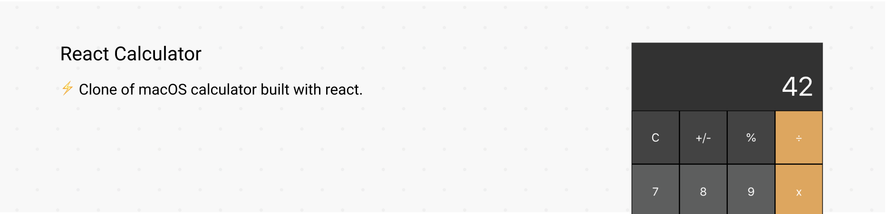

## Clone of macOS calculator built with react

[](https://circleci.com/gh/chamoda/react-calculator/tree/master)

Purpose of this project to learn basic React.

Checkout the [demo](https://chamoda.com/react-calculator/)

⚡️ PWA ready with offline support.

## How to run

Clone the repo, then run using npm.

```bash
git clone https://github.com/chamoda/react-calculator.git && cd react-calculator
npm install
npm start
```

To run tests type

```bash
npm start
```

To run eslint checks

```bash
npm run lint
```
